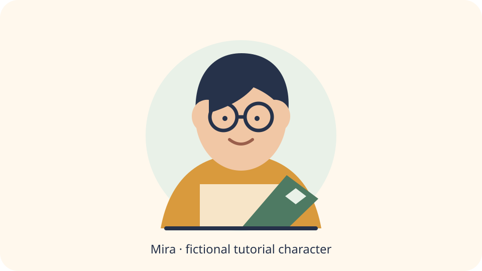

# Custom IP Illustration Skill

[简体中文](README.md) | [English](README.en.md)

Turn a character you own or are authorized to use into consistent illustrations for articles, scripts, and keyframes. The Skill handles content direction, character acting, composition, prompts, reference selection, and QA. Image rendering is delegated to image tools already available in the host Agent.



> Mira is an original fictional tutorial character included with this repository. She is never selected as your character automatically and contains no creator identity, private brand, or private knowledge-base traits.

## What it does

- Creates independent 16:9, 1:1, and 9:16 compositions for one consistent character.
- Converts an article or script into character actions, physical metaphors, and per-image prompts.
- Preserves appearance, clothing, props, and personality anchors across images.
- Uses image tools already available in the host Agent; without one, it still delivers complete prompts and a render request.
- Does not ask ordinary users to configure a router, provider, model, service URL, or API credential.
- Writes runtime output to the user's project, never into the installed Skill.

## Install in one minute

You need Node.js for installation, Python 3.10+ for compilation, and a Skills-compatible Agent. Run:

```bash
npx skills add wukongai/custom-ip-illustration-skill
```

The installer will ask which Agent to target and whether to install for the current project or globally.

Non-interactive Codex example:

```bash
cd <your-target-project>
npx skills add wukongai/custom-ip-illustration-skill \
  --skill custom-ip-illustration \
  -a codex \
  -y
```

Enter the target project directory before using the non-interactive command; otherwise the installer may choose global scope. Use the interactive command above when unsure.

Installing the Skill does not install or purchase an image API. If the host Agent already has image generation, the Skill can use it. Otherwise it enters `compile_only` mode and still produces reusable prompts. Never put API credentials in this repository or in a character profile.

## First run: use the fictional tutorial character

After installation, tell your Agent:

```text
Use the fictional tutorial character from custom-ip-illustration to compile
two 16:9 illustrations for the example article. Do not render images yet;
only create prompts and the render request.
```

The Agent will explicitly say that it is using the tutorial character Mira, then read:

- `examples/ip-profile.example.json` for the character definition;
- `examples/brief.example.json` for the example article;
- `examples/demo-character.svg` as a human-readable visual preview only.

After cloning the source from GitHub, a developer can also verify the compiler from the source repository root. Standard-install users only need the Agent prompt above; the Agent resolves the installed Skill script itself:

```bash
python3 scripts/compile_ip_illustration.py \
  --profile examples/ip-profile.example.json \
  --brief examples/brief.example.json \
  --output-dir /tmp/custom-ip-demo
```

A successful run creates:

```text
/tmp/custom-ip-demo/
├── prompts/
│   ├── 01-*.md
│   └── 02-*.md
├── render-request.json
└── run-manifest.json
```

## Use your own character

When no profile exists yet, say:

```text
Use custom-ip-illustration to help me create a profile for my own character,
then make three landscape illustrations for this article. Ask one question
at a time and show me the profile before saving it.
```

You do not need to write JSON. The Skill will:

1. confirm that you own the character or have permission or a license;
2. collect the character name and one-sentence identity;
3. collect appearance, signature features, personality, and immutable continuity anchors;
4. optionally register reference images authorized for this task;
5. show a profile summary;
6. save it to `.custom-ip-illustration/ip-profile.json` only after your confirmation;
7. ask for image count, canvas, and whether to render, then compile the request.

In the same project, a later request such as “use my character for this article” will discover that profile first. The Agent still asks before modifying or replacing it.

The profile is plain-text JSON and may contain appearance details, the rights basis, and local reference paths. If the project syncs to Git or cloud storage, confirm that those details may be synced. Add `.custom-ip-illustration/` to the project's `.gitignore` when the profile should remain local.

## How image backends work

Most users do not configure an interface inside this Skill:

- a native host image tool is used automatically;
- a single compatible third-party image tool is used automatically;
- when several third-party tools are available, the Agent asks you to choose one;
- with no image tool, the Skill delivers prompts and a manifest without pretending images were rendered.

Advanced users may connect their own image MCP or backend. That backend—not this Skill—owns its credentials, connection setup, and model routing. See [backend selection](references/backend-selection.md).

## Optional preferences

Copy `EXTEND.example.md` to one of these locations:

1. Project: `.custom-ip-illustration/EXTEND.md`
2. XDG: `${XDG_CONFIG_HOME}/custom-ip-illustration/EXTEND.md`
3. User: `${HOME}/.custom-ip-illustration/EXTEND.md`

The first file found wins. Preferences may contain style, canvas, output directory, batch size, language, and a backend id. They must not contain credentials or service URLs.

## Troubleshooting

**Why did I get prompts but no images?**  
The host Agent has no compatible image tool, or you requested planning only. This is a valid `compile_only` result.

**Why does the first run ask about character rights?**  
The Skill only handles characters you own, are authorized to use, or have a clear license for. It will not imitate an unlicensed protected character.

**Will Mira appear in my real work?**  
No. She is used only when you explicitly request the tutorial. A real task without a profile starts the onboarding flow instead.

**May I reuse the Mira demo assets?**  
Yes. Mira and the demo SVG are original tutorial assets created by repository contributors and are explicitly licensed with this repository. See [LICENSE](LICENSE) and [NOTICE](NOTICE).

**Do I need to configure a particular router?**  
No. The Skill discovers image tools exposed by the host and does not depend on a particular routing implementation.

## Develop and verify

To inspect the source, modify templates, or contribute:

```bash
git clone https://github.com/wukongai/custom-ip-illustration-skill.git
cd custom-ip-illustration-skill
python3 -m unittest discover -s tests -p 'test_*.py'
python3 scripts/verify_release.py --root . --manifest public-release-manifest.json
```

The runtime uses only the Python standard library.

## Update and uninstall

- Update by running the install command again or using your Skill manager's update flow.
- Uninstall `custom-ip-illustration` with your Skill manager, or remove its directory after a manual install.
- Character profiles and generated images in user projects are outside the Skill installation and are not removed automatically.

See [SECURITY.md](SECURITY.md) for security reports and [CONTRIBUTING.md](CONTRIBUTING.md) for contributions.
