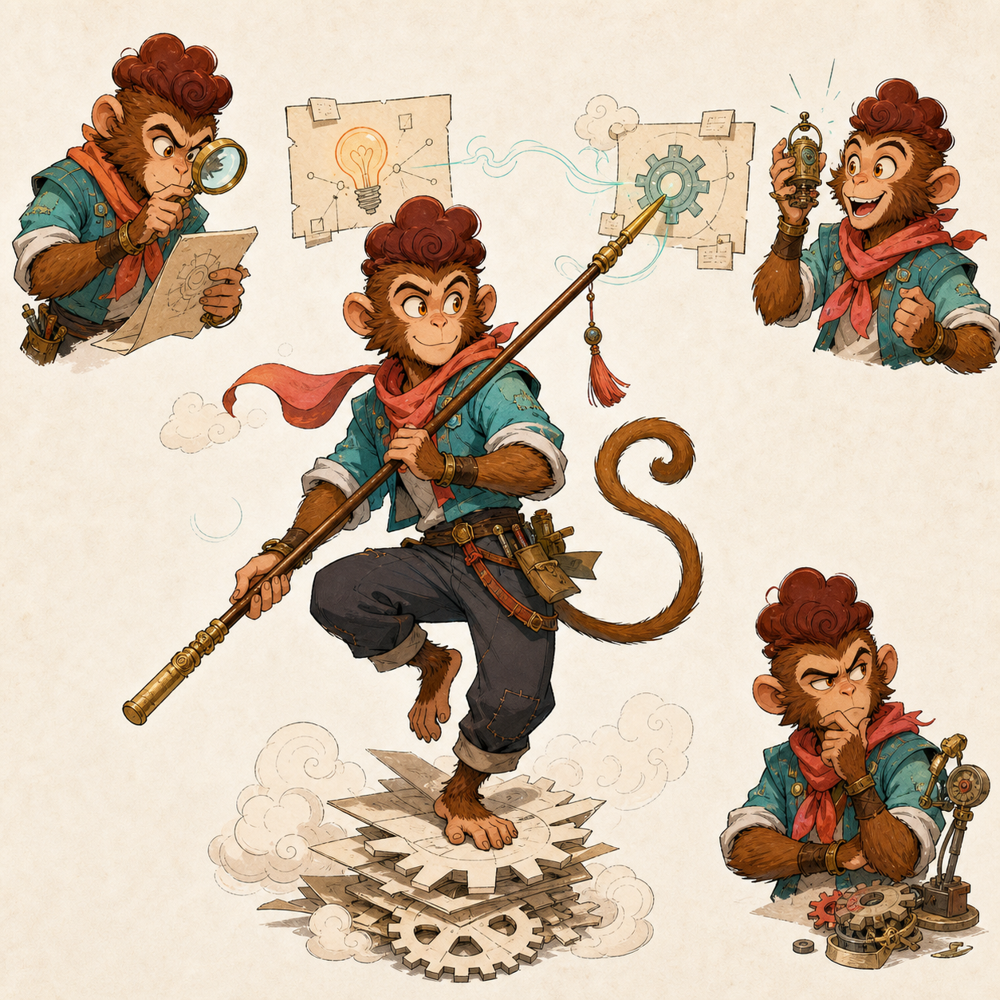

# Custom IP Illustration Skill

[简体中文](README.md) | [English](README.en.md)

把一篇文章变成由同一个原创 IP 角色出演的系列配图。你不需要先理解脚本、JSON 或模型参数，按下面四步走即可。

## 1. 安装 Skill

在你的项目目录运行：

```bash
npx skills add wukongai/custom-ip-illustration-skill
```

安装器会询问目标 Agent 和安装范围。安装完成后，对 Agent 说：

```text
使用 custom-ip-illustration。先检查安装，然后带我完成第一次使用。
```

Agent 会自行定位 Skill 和运行所需脚本；正常使用不需要你手动安装依赖。

## 2. 选择出图方式

第一次运行时，Agent 必须先展示下面四种方式，由你选择，不会静默替你决定：

1. **Codex Image Tool / 内置 `imagegen`（推荐）**：使用 GPT Image 2；由 Codex 提供图片工具，不需要你配置或提供 API Key。
2. **直接 OpenAI API**：本 Skill 自带 GPT Image 2 调用脚本；需要你自己的 `OPENAI_API_KEY`，图片费用进入你的 OpenAI API 账户。若检查结果为 `unsupported_platform`，这一方式当前不可用，请改选其他方式。
3. **已有 `ai-router`**：只适合已经安装并注册 `ai_router.generate_image` 的用户；Key、provider 和 model 都继续留在 Router 内。
4. **`prompt-only`**：只编译 prompt、render request 和 manifest，不会生成图片，结果状态为 `compile_only`。

可以直接说：

```text
这次用 Codex Image Tool。只作用于这次任务，不要保存为默认偏好。
```

只有你明确说“以后默认用这个”，Agent 才会保存后端偏好。已保存方式失效时，Agent 会重新让你选择，不会悄悄切到可能收费的方式。

### 直接 OpenAI API 的安全配置

选择“直接 OpenAI API”后，让 Agent 运行 `doctor` 检查；缺少凭证时再运行 `configure`。`configure` 使用隐藏输入，并把 Key 保存到用户级 `~/.custom-ip-illustration/.env`，权限限制为当前用户读取。也可以只在当前进程环境中提供 `OPENAI_API_KEY`。

不要把 Key 粘贴到聊天、仓库、角色资料、`EXTEND.md` 或文章里。Agent 不应回显 Key。你可以从 [OpenAI API Keys](https://platform.openai.com/api-keys) 创建 Key；API 使用可能还需要账户额度或组织验证。

直接 renderer 严格使用编译请求中的精确尺寸：`16:9 = 1536x864`、`1:1 = 1024x1024`、`9:16 = 1152x2048`。宽高都必须是 16 的倍数并满足 GPT Image 2 的边长、宽高比和总像素限制；renderer 不会替换为近似尺寸。每次 `render` 都应使用尚不存在的输出文件名；若任一目标已存在，会在调用 API 前停止并保留原文件。

### 已有 ai-router

这个入口只连接宿主已经提供的 `ai_router.generate_image`。本项目不引导下载任何私有 Router 仓库，也不读取 Router 的环境文件；连接、凭证、模型选择、重试和 fallback 都由你的 Router 管理。

## 3. 建立你的卡通 IP

如果要建立自己的角色，先准备一张本人或已获授权的真人照片，以及这段母版提示词：

```text
把这张本人或已获授权的真人照片转成原创卡通 IP 角色母版。保留可识别的发型、脸型、眼镜等非敏感外观锚点，但不要推断敏感属性；设计为全身角色，干净中性背景，同时展示正面、侧面、背面等多视角和 4 个常用表情。造型简洁，适合文章系列配图并能跨图保持一致。无文字、水印或 logo，不模仿任何第三方角色特征。
```

根据第 2 步的选择继续：

- **Codex Image Tool 或已有 `ai-router`**：在对话中附加真人照片和上面的母版提示词，让已选工具生成 `character-master.png`。
- **直接 OpenAI API**：先完成 `doctor / configure`，再让 Agent 保持在你的用户项目目录，用 `<skill-root>` 定位已安装脚本：

```bash
python3 <skill-root>/scripts/openai_backend.py master --reference <project-photo-path> --output <project-character-master.png>
```

`<project-photo-path>` 和 `<project-character-master.png>` 都应位于你的项目中，不要把输入或输出写进 Skill 安装目录。母版输出必须使用 `.png` 后缀。

如果输出文件已存在，命令会在调用图片 API 前停止；请改用新的输出文件名，不会覆盖已有母版。

若前面的 `doctor` 返回 `unsupported_platform`，不要运行 `master`、继续重试或静默切换；回到第 2 步选择 Codex Image Tool、已有 `ai-router` 或 `prompt-only`。

- **`prompt-only`**：Skill 只输出母版 prompt，不会把照片变成图片。把 prompt 和照片交给你自己的外部图片工具，生成后再上传母版；也可以直接选择下面的教程角色。

母版满意后，对 Agent 说：

```text
用这张卡通母版建立我的 ip-profile；一次只问一个问题，保存前先让我确认。
```

Agent 会先确认权利来源，再提取角色身份、外观、性格和连续性锚点。只有你确认后，它才保存到项目的 `.custom-ip-illustration/ip-profile.json`。该文件可能含本地参考图路径；不希望同步到 Git 或云盘时，把 `.custom-ip-illustration/` 加入项目的 `.gitignore`。

不想上传照片，也可以用一个原创教程角色体验：

| 悟空知识工匠 | 月兔地图师 |
|---|---|
|  |  |
| [角色资料](examples/characters/wukong/profile.json) | [角色资料](examples/characters/moon-rabbit/profile.json) |

请明确二选一。两个角色都不会被默认选中，也不会保存成你的 profile；它们只用于本次教程。

## 4. 把文章交给 Skill

最短指令：

```text
用我的 IP 给下面这篇文章做 3 张 16:9 配图，这次使用 Codex Image Tool。先给出配图点，再生成并逐张检查：<粘贴文章>
```

如果使用教程角色，把“我的 IP”替换成“悟空知识工匠”或“月兔地图师”。Skill 会先把每张 prompt 写入 `prompts/`，再按你选择的后端逐张生成和 QA。

- 选择前三种可用后端且生成成功：结果包含实际图片文件、prompt、`render-request.json` 和运行清单。
- 选择 `prompt-only`：结果只包含 prompt、`render-request.json` 和运行清单，不应声称已经出图。
- 某张失败：Agent 必须逐张说明，不用“全部成功”掩盖部分失败。

## 安装或首次运行失败时

正常安装和首次运行由 Agent 处理依赖。安装命令失败时检查 Node.js 和 `npx`；安装成功但首次编译失败时，再检查 Python 3.10+。

Windows 仍可安装和使用其他出图方式；若直接 OpenAI API 报 `unsupported_platform`，请改选其他方式。PowerShell 使用单行安装命令：

```powershell
npx skills add wukongai/custom-ip-illustration-skill
```

## 可选偏好

需要长期保存画幅、风格或后端时，把 `EXTEND.example.md` 复制为项目 `.custom-ip-illustration/EXTEND.md`。偏好文件只能保存普通配置，不能保存 Key、token、cookie、服务地址或模型路由。

## 开发者验证

```bash
git clone https://github.com/wukongai/custom-ip-illustration-skill.git
cd custom-ip-illustration-skill
python3 -m unittest discover -s tests -p 'test_*.py'
python3 scripts/verify_release.py --root . --manifest public-release-manifest.json
```

安全问题见 [SECURITY.md](SECURITY.md)，贡献方式见 [CONTRIBUTING.md](CONTRIBUTING.md)。
