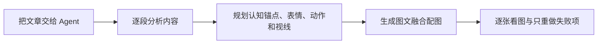

# IP Pic 用户手册

IP Pic 帮内容创作者使用固定原创或已授权角色，为短文、长文章和静态视频画面配图。

打开 Codex、Claude Code、WorkBuddy 或其他 Agent，把下面的示例直接发给它即可。安装、内容提炼、画面导演、提示词、出图和检查都由 Agent 完成。

默认优先使用一次图文融合：图片模型一次完成角色、画面和少量中文，适合文章配图。只有你明确要求固定字体，或只想改字、不想重画人物时，才使用“先无字图再加标题”。

<!-- IP-PIC-ILLUSTRATION:hero-user-journey 建议插入原创 IP 演示图：文章进入 Agent，输出逐段相关的图文融合配图。 -->



## 第一步：让 Agent 安装并开始

```text
帮我安装并使用这个配图工具：
https://github.com/wukongai/ip-pic-skill
安装完成后，带我完成第一次配图。
```

Agent 会自动完成安装和检查，并先用一句话告诉你“安装与自检通过”或说明唯一失败原因。只有需要你的授权、需要你看图，或可能产生额外费用时，才会停下来询问。

## 第二步：直接运行示例

安装后，把这一段直接发给 Agent：

```text
使用 IP Pic 的学习向导阿拓示例，给下面这段文字配 1 张图：

真正让项目变快的，不是把计划写得更细，而是更早拿到可以检查的小结果。
```

你不需要先选择模板、风格、比例、字体或图片工具。Agent 会使用 IP Pic 的推荐设置，并优先使用可用的 GPT Image 2 图片工具。

开始生成前，Agent 还会自动确认当前写作项目和图片保存位置。如果你尚未打开项目，它会说明写作项目只是一个保存文章和图片的文件夹，并给你 2–3 个安全选项；你确认后，它可以创建一个“IP Pic 教程项目”。不要把角色参考图、成品或个人风格写进已安装的 IP Pic Skill。首次完成时，Agent 会告诉你实际保存位置。

公开包只带有阿拓的原创文字设定，不带人物图片。第一次运行这个示例时，Agent 会自动先生成阿拓参考图给你看。满意只需回复：

```text
可以，继续。
```

如果不满意，直接描述你看到的问题：

```text
人物太幼稚了，改成成年学习向导，保留眼镜和服装配色，重新出一个新版本。
```

Agent 会保留旧图，不会把你否决的图片用于后续配图。确认参考图后，它会继续完成示例，你最终应看到一张真实配图，而不是只有提示词。

如果 Agent 告诉你当前没有可用的图片工具，再打开[图片工具接入说明](IMAGE-TOOL-SETUP.zh-CN.md)。正常使用不需要先读它。

## 第三步：给自己的文字配图

### 一段文字

```text
用刚才的阿拓给下面这段文字配 1 张图：

<粘贴文字>
```

### 一整篇文章

把文章粘贴进聊天、拖入 Markdown 文件，或者直接说：

```text
用刚才的阿拓给这篇文章配图：

<粘贴文章或拖入文件>
```

如果 Agent 能读取你当前打开的 Obsidian 文章，只需说：

```text
用刚才的阿拓给我当前打开的 Obsidian 文章配图。
```

Agent 会分析文章，先告诉你建议做几张、每张表达什么。你确认后，它才连续出图并逐张给你看。它不会机械地每段配一张，也不会要求你自己写配图点或提示词。

如果你希望严格逐段分析并检查每张图与对应段落的关系，直接说：

```text
请逐段分析这篇文章。
先列出每个段落的核心意思，以及准备使用的画面、表情、动作和视线；
再为每个值得配图的段落生成一张图。
完成后逐张说明它对应哪个段落，不相关的图片不要算通过。
```

Agent 应先给你一个很短的计划，例如“第 2 段：区分问题与噪声；人物拆开纠缠的任务线；质疑检查表情；视线看向异常结”。成片必须能从画面中看出这层关系，不能只换标题、重复一张通用插画。

<!-- IP-PIC-ILLUSTRATION:article-paragraph-map 建议插入原创 IP 演示图：同一文章的 3–6 个段落对应不同动作与构图。 -->

如果你已经确认全部图片，并希望放回文章，再说：

```text
全部图片已经确认。
请按照当前 Obsidian 项目已有的附件规则保存图片，
把图片链接插入刚才规划的文章位置。
如果没有现成附件规则，先告诉我一个安全、可恢复的项目内方案。
修改前告诉我会改哪篇文章、哪些位置，并保留可恢复的原版本。
```

这一步由你的 Agent 完成文件操作。IP Pic 本身不接管 Obsidian，也不负责发布文章。

## 第四步：换成你自己的角色和参考图

准备 1–5 张你本人拥有或已经取得授权的角色图片，直接拖给 Agent，然后说：

```text
我要用自己的角色做 IP 配图。
这些参考图是我本人原创或已经取得授权的素材。

请根据图片整理角色资料和连续性特征，先给我确认；
确认后保存在我的写作项目中，不要写进公开 Skill。
```

Agent 会整理角色名称、公开身份、外观特点、性格和连续性锚点。它不应推断年龄、健康、民族、宗教等敏感信息；缺少真正必要的信息时，一次只问你一个问题。

确认时说：

```text
角色资料可以。请保存为“<角色名称>”，以后用这个名称调用。
```

以后正常使用只需要：

```text
用“<角色名称>”给这篇文章配图：

<粘贴文章或提供 Obsidian 文件>
```

如果只想用其中一张：

```text
这次只使用我刚上传的正面角色图，其他图片不要加入参考。
```

### 自己制作一套更好的参考图

只有在你想改善角色连续性时，才需要做这一步。把已有角色图交给 Agent，然后说：

```text
请为“<角色名称>”制作一套新的角色参考图：
正面、侧面、全身和常用表情，服装与配色保持一致，
不要文字、水印或 logo。

先逐张给我看；我确认后再保存为新的参考图版本，
保存为“<角色名称>-参考图-02”，不要覆盖当前默认版本。
```

你可以继续用普通话调整，例如：

```text
侧面不像正面版本。保持脸型、发型和眼镜一致，只重做侧面。
```

需要找回旧版或切换默认参考图时：

```text
请列出“<角色名称>”现有的参考图版本、默认版本和创建时间。
这次改用“<版本名称>”，不要删除其他版本。
```

## 第五步：修改现有风格

先说你要改什么，再让 Agent 出一个新版本。它会保留角色身份、文章意思和旧图。

```text
把这组图改成毛毡手作风格，生成新版本，不要覆盖旧图。
```

也可以直接说：

```text
改成简约线稿。
```

```text
改成贴画拼贴。
```

```text
改成松弛手绘。
```

```text
改成高冲击风格。
```

```text
改成艺术版画。
```

如果想以某个内置风格为基础继续调整，同时保留原版：

```text
以 IP Pic 的“毛毡手作”为基础，
把颜色降低一点、纸张质感减弱，其他规则保持不变。
先用阿拓出 1 张预览；通过后另存为个人风格“柔和毛毡-01”，
不要修改或覆盖内置毛毡手作。
```

修改比例也只需一句话：

```text
把下一张改成 1:1，内容和角色保持不变。
```

```text
这篇文章全部使用 16:9 横图。
```

```text
改成 9:16 竖屏，底部保留字幕安全区。
```

### 单独调整表情、动作和视线

```text
内容和风格都不变，只把人物改成恍然领悟的表情，
身体微微前倾，视线看向台阶顶端的完成标记。
生成新版本，不覆盖旧图。
```

```text
保留这张图的文字和装置，只重做人物表演：
背后三分之四姿态，一只手操作装置，另一只手取出结果，
表情冷静、一本正经又略显无辜，视线看向手里的结果。
```

如果你指定了表情、动作、视线或姿态，Agent 的逐图检查必须分别核对，不能只因为文章意思相关就算全部通过。

## 第六步：新增自己的风格

当内置风格都不合适时，你可以用文字或你有权使用的风格参考图来创建个人风格。

### 用文字描述

```text
我想新增一个自己的配图风格：
像手账里的彩铅速写，纸张有轻微颗粒，颜色低饱和，
人物线条松弛，但中文标题仍然较粗、端正，并保留一条手绘强调线。

先用阿拓示例出 1 张预览，不要改动现有风格。
```

### 用图片说明

把你原创或已获授权的风格参考图拖给 Agent，然后说：

```text
请分析我提供的图片，只提炼线条、材质、配色、留白和排版，
不要复制其中的人物、品牌、文字或独特构图。
先用阿拓示例做 1 张新风格预览。
```

满意后说：

```text
这版通过。请保存为我的个人风格“<风格名称>”，
以后我说这个名称时使用；不要覆盖 IP Pic 的内置风格。
```

还想微调时，继续描述差异：

```text
把纸张颗粒减弱，人物线条再粗一点，其他不变。
保存为“<风格名称>-02”，不要覆盖上一版。
```

个人风格默认保存在当前项目。换项目时，可以让 Agent 复制或重新登记到新项目，但必须保留版本且不覆盖。新增风格只改变画面表现，不应偷偷改变角色身份、文章意思、画幅或文字模式。

跨项目使用时可以说：

```text
请把当前项目中的个人风格“<名称>”复制到“<新项目>”，
保留原名称和版本，不覆盖新项目中的同名风格。
完成后列出来源和新保存位置。
```

## 第七步：修改文字效果

### 文字和画面一次生成

```text
继续使用一次图文融合，画面里保留少量短中文。
```

默认效果是较粗、端正的中文展示字，标题下有一条手绘强调线，不是楷体、儿童体或纤细字体。

### 先出无字图，再加稳定文字

```text
改成先无字图再加标题。
使用 IP Pic 默认的较粗中文标题样式和手绘强调线。
如果当前已有通过的无字底图，就只重新排版文字，不要重生人物底图。
如果当前只有图文融合成品，请先生成一个新的无字底图让我确认，
再在这张底图上加入标题；不要在旧文字上叠加新文字。
```

如果你有权使用自己的字体文件，把文件拖给 Agent：

```text
标题使用我刚提供的中文字体。
保留已经通过的无字底图，只生成新的文字版本，不要覆盖旧图。
```

一次图文融合的字由图片模型生成，不能精确锁定本机字体；需要固定字体时，应使用“先无字图再加标题”。

## 第八步：控制数量、版本和失败重做

```text
这篇文章只做 3 张图，由你选择最值得画的 3 个位置。
```

```text
先做前两张，我确认以后再继续。
```

```text
第二张的人物不像。保留其他已通过图片，只重做第二张；
旧图不要覆盖，也不要作为新参考图。
```

```text
人物和底图都通过了，只把标题字体改粗一点，
保持单条手绘强调线。
```

```text
保留这一批作为旧版本，整批换一个新方向，
不要继承我已经否决的图片。
```

Agent 可以辅助检查人物、构图、文字和安全区，但最终是否通过必须由你本人看图决定。

素材变多以后，可以随时只读查看：

```text
请列出当前项目中的角色、参考图版本和个人风格，
用普通话说明当前默认选择，不要修改任何内容。
```

## 第九步：静态视频关键帧

```text
用我的角色把下面内容做成 1:1 静态视频关键帧。
先生成无字画面，再加入栏目名、粗体核心观点、
单条手绘强调线和补充文字；底部保留字幕安全区。

<粘贴内容>
```

IP Pic 只生成静态关键帧，不负责动画、口型、配音或视频剪辑。

## 权利、隐私和费用

- 只使用你原创、本人拥有或已获授权的角色、字体和参考图。
- 不要求精确复刻未授权的知名角色。
- 角色资料、参考图和个人风格保存在你的项目中，不写回公开 Skill。
- 被否决的图片不能自动成为后续参考图。
- 可能产生额外 API 费用时，Agent 应先说明并等你确认。

## 关于这个独立版本

IP Pic 是从更大的工作流中独立拆分出来的公开 Skill。发行前已完成自动化合同、安全、隐私、模板、风格、批量、失败重做和真实图片链路测试；但不同 Agent、图片模型、字体和运行环境仍可能带来视觉差异。

建议第一次先运行阿拓短文示例，再测试自己的文章和已授权角色。自动检查不能代替你本人看图。如果发现可复现的问题，请保留原文、使用的 Agent、选择的图片工具、失败图片和你看到的现象，再提交反馈；不要附带 API Key、凭证或无权公开的参考图。

测试范围、已验证项目和仍需人工看的内容见[验证说明](docs/VERIFICATION.zh-CN.md)。

<!-- IP-PIC-ILLUSTRATION:release-feedback 建议插入原创 IP 演示图：用户看图、标记问题、Agent 只重做失败项。 -->

## Agent 卡住时

先说：

```text
请继续按 IP Pic 用户手册完成，不要让我处理内部命令或配置。
如果确实缺少图片工具，只告诉我唯一的下一步。
```

只有 Agent 明确说“没有可用图片工具”时，再把[图片工具接入说明](IMAGE-TOOL-SETUP.zh-CN.md)交给它。

## 常用一句话

```text
使用 IP Pic 的学习向导阿拓示例，给下面这段文字配 1 张图：<文字>
```

```text
用“<角色名称>”给这篇文章配图：<文章或文件>
```

```text
改成毛毡手作和 1:1，生成新版本，不覆盖旧图。
```

```text
保存为我的个人风格“<风格名称>”，不要覆盖内置风格。
```

```text
保留成功图片，只重做失败项。
```
